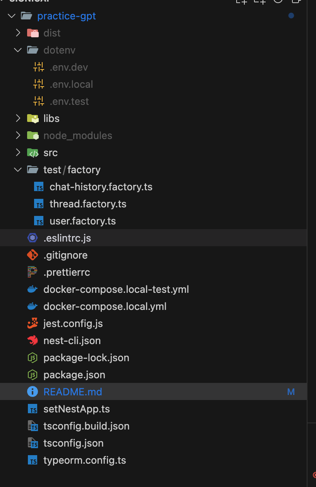

## 사용한 언어, 프레임워크, 개발 도구

- TypeScript
- NestJS
- TypeORM
- PostgreSQL
- Docker
- Docker Compose
- Jest

## 로컬 프로젝트 실행 방법

1. 해당 명령어를 통해 local-db를 실행합니다.

```
npm run docker:up:local
```

2. dotenv 폴더 및 env 파일 생성



```
- 루트 폴더에 dotenv 폴더를 생성해주세요.
- dotenv 폴더 내에 .env.local 파일을 생성해주세요.
```

env 파일 내용은 아래와 같습니다.

```
# APP
PORT=3000
BASE_URL=http://localhost

# DB
DB_USER_NAME=postgres
DB_DATABASE=postgres
DB_PASSWORD=postgres
DB_PORT=5432
DB_HOST=localhost

# JWT
JWT_SECRET=ASDJASDASDJLBDS213123
JWT_ACCESS_TOKEN_EXPIRES_IN=30m
JWT_REFRESH_TOKEN_EXPIRES_IN=14d

# OPENAI
OPENAI_API_KEY=키를 입력해주세요
```

3. Dependencies 설치

```
npm install
```

4. 서버 실행

```
npm run start:local
```

5. docker-compose 중지

```
npm run docker:down:local
```

## 테스트 계정

- npm run seed 명령어를 통해 테스트 계정을 생성합니다.

```
npm run seed
```

<br>

- 일반 계정

```
email: 'test1@test.com'
password: 'test'

email: 'test3@test.com'
password: 'test'
```

- 관리자 계정

```
email: 'test2@test.com'
password: 'test'
```

<br>

## 테스트 코드 실행 방법

1. 테스트 용 docker-compose 실행

```
$ npm run docker:up:local-test
```

2. 테스트 코드 실행

```
$ npm run test
```

3. 테스트 용 docker-compose 중지

```
$ npm run docker:down:local-test
```

<br>

## 설계 및 패턴

### 주요 설계 특징

A. 모듈화 (Modularity)

- 각 기능별로 독립적인 모듈로 분리
- 기능 확장과 유지보수가 용이
- 높은 응집도와 낮은 결합도

B. Global Core Module

- 공통 기능들을 CoreModule로 중앙화
- 트랜잭션 관리, 설정, JWT, 인터셉터 등 공통 기능 제공
- 중복 코드 방지와 일관된 정책 적용 가능

C. 제네릭 리포지토리 패턴

- 공통 CRUD 작업을 제네릭 리포지토리로 추상화
- 코드 재사용성 증가
- 일관된 데이터 접근 패턴 제공

D. 트랜잭션 관리

- 전역 트랜잭션 미들웨어를 통한 일관된 트랜잭션 관리
- 데이터 일관성 보장
- 트랜잭션 관리 코드의 중복 제거

E. 인터셉터 활용

- 응답 형식 표준화
- 전역 에러 처리
- Cross-cutting Concerns 효과적 처리

F. 보안

- JWT 기반 인증
- 가드를 통한 접근 제어
- 보안 정책의 중앙화된 관리

<br>

## Workflow 및 구현 패턴

### 공통 기능

- Transactional Decorator 구현
- ErrorInterceptor, TypeORMException, TypeORMExceptionFilter 구현
- GenericTypeormRepository 구현

<br>
